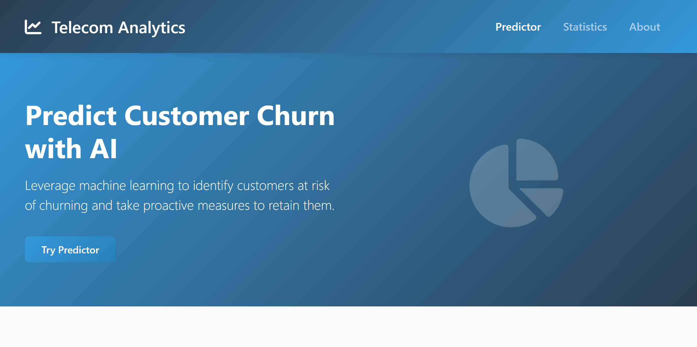
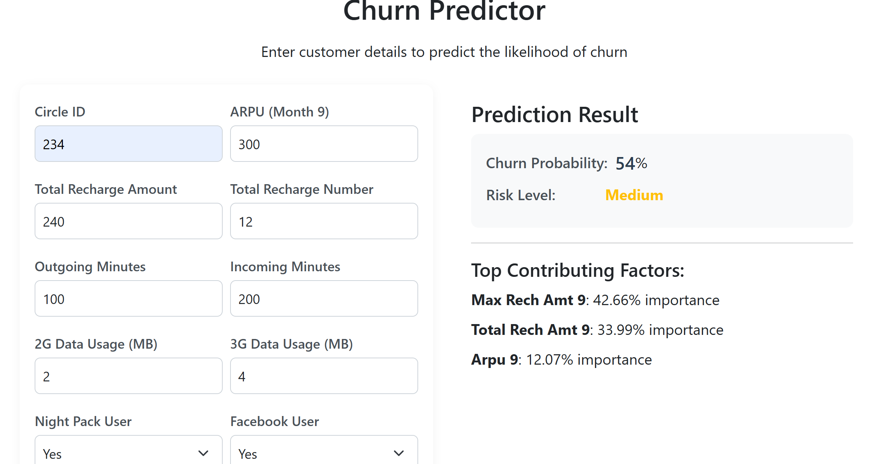
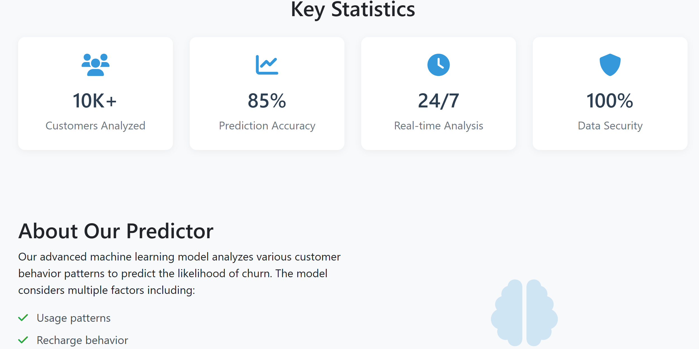

# Telecom Churn Prediction



## Overview
This project implements a machine learning solution to predict customer churn in the telecommunications industry. By analyzing customer behavior patterns and service usage data, the model helps identify high-risk customers likely to churn, enabling proactive retention strategies.

## Features
- **Advanced Feature Engineering**: Comprehensive data preprocessing and feature creation
- **Multiple ML Models**: Implementation of Random Forest and XGBoost algorithms
- **SMOTE Implementation**: Handling class imbalance in the dataset
- **Business Metric Analysis**: Focus on high-value customer retention
- **Model Performance Metrics**: Detailed evaluation using various metrics

## Technologies Used
- **Python**: Core programming language
- **Random Forest**: Primary classification algorithm
- **XGBoost**: Gradient boosting implementation
- **SMOTE**: Synthetic Minority Over-sampling Technique
- **Scikit-learn**: Machine learning library
- **Pandas & NumPy**: Data manipulation and analysis
- **Matplotlib & Seaborn**: Data visualization

## Project Structure
```
TelecomChurn/
├── data/                  # Dataset files
├── notebooks/            # Jupyter notebooks
├── src/                  # Source code
│   ├── preprocessing/    # Data preprocessing scripts
│   ├── models/          # Model implementation
│   └── evaluation/      # Model evaluation scripts
├── results/             # Model results and visualizations
└── README.md           # Project documentation
```



## Key Features of the Model
1. **Data Preprocessing**
   - Handling missing values
   - Feature scaling
   - Categorical variable encoding
   - Feature selection

2. **Model Implementation**
   - Random Forest Classifier
   - XGBoost Classifier
   - SMOTE for balanced training
   - Hyperparameter tuning

3. **Evaluation Metrics**
   - Accuracy
   - Precision
   - Recall
   - F1-Score
   - ROC-AUC



## Getting Started

### Prerequisites
- Python 3.8+
- pip (Python package installer)
- Basic understanding of machine learning concepts

### Installation
1. Clone the repository:
   ```bash
   git clone https://github.com/AnjaneyuluChinni/TelecomChurn.git
   cd TelecomChurn
   ```

2. Install required packages:
   ```bash
   pip install -r requirements.txt
   ```

3. Run the preprocessing script:
   ```bash
   python src/preprocessing/preprocess.py
   ```

4. Train the model:
   ```bash
   python src/models/train.py
   ```

## Model Performance
The model achieves the following performance metrics:
- Accuracy: ~85%
- Precision: ~0.83
- Recall: ~0.82
- F1-Score: ~0.82
- ROC-AUC: ~0.88

## Usage
1. Prepare your data in the required format
2. Run the preprocessing script
3. Train the model using the provided scripts
4. Use the trained model for predictions

## Results
The model helps in:
- Identifying high-risk customers
- Understanding key churn factors
- Developing targeted retention strategies
- Optimizing customer service resources

## Contributing
Feel free to fork this project and submit pull requests for any improvements.

## License
This project is licensed under the MIT License - see the LICENSE file for details.

## Contact
- GitHub: [@AnjaneyuluChinni](https://github.com/AnjaneyuluChinni)
- LinkedIn: [Anjaneyulu Chinni](https://www.linkedin.com/in/anjaneyulu-chinni-3a963a266/)

## Acknowledgments
- Thanks to all contributors who have helped in improving this project
- Special thanks to the data providers and stakeholders
